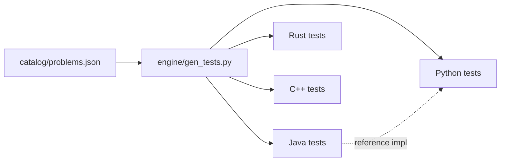

<div align="center">

# algorithm-discovery-engine

**One catalog, four languages, zero dependencies — and a synthesizer that rediscovers the algorithms for you.**

[](https://github.com/dsk-dev-ai/algorithm-discovery-engine/actions/workflows/ci.yml)
[](https://github.com/dsk-dev-ai/algorithm-discovery-engine/stargazers)
[](https://github.com/dsk-dev-ai/algorithm-discovery-engine/forks)
[](https://opensource.org/licenses/MIT)
[]()
[](https://github.com/sponsors/dsk-dev-ai)

**Python** · **Java** · **C++** · **Rust**


</div>

---

**The same algorithms and data structures, solved, tested, and benchmarked in Java, C++,
Rust, and Python**, with one `catalog/problems.json` as the single source of truth and
byte-identical generated test vectors across every language. On top sits a local
**algorithm synthesizer** that discovers verified algorithms (Kadane, buy-and-sell, jump
game) from input/output examples alone — no APIs, no model calls.

## Features

- **Multi-language solving engine** — 10 algorithms + 6 data structures implemented in
  Java, C++17, Rust, and Python (regular + optimized advanced tiers).
- **Cross-language benchmarks** — a single harness times all four tiers; compare
  strategies (Java's hash-map two-sum vs. the quadratic scans in C++/Rust).
- **Local algorithm synthesizer** — grammar-based search + strategy templates that
  rediscover known algorithms and surface novel ones, fuzz-verified out-of-sample.
- **Automated mathematical pattern discovery** — the original engine: feed in a
  sequence, get ranked hypotheses (arithmetic, geometric, quadratic, Fibonacci-like) and
  next-term predictions.
- **Zero dependencies per language** — no framework, no package, no JIT magic; pure
  standard library in all four tiers.
- **Generated-then-committed test vectors** — identical tests enforced by CI in every
  language; a single `--check` keeps them in sync with the catalog.
- **CI-green by default** — grid of Python 3.10–3.13, Java 21, GCC C++17, stable Rust,
  plus a discovery-smoke job.

## Quick start

```sh
git clone https://github.com/dsk-dev-ai/algorithm-discovery-engine.git
cd algorithm-discovery-engine

python engine/runner.py test        # build + run the catalog suite in all 4 languages
python engine/runner.py bench       # benchmark all tiers, side by side
python engine/runner.py discover    # synthesize + verify algorithms from examples
```

No install required — Python ≥ 3.10 and (for the non-Python tiers) a JDK, a C++17
compiler, and the Rust toolchain.

## The multi-language engine

### Catalog

`catalog/problems.json` is the source of truth. Every algorithm and structure carries a
shared test vector set asserted in **all four languages**.

| Algorithms (10)                                          | Data structures (6)                              |
| -------------------------------------------------------- | ------------------------------------------------ |
| `two_sum`, `binary_search`, `merge_sort`, `quick_sort`    | `stack`, `queue`, `linked_list`, `bst`           |
| `max_subarray`, `lcs`, `knapsack_01`, `edit_distance`     | `trie`, `min_heap`                               |
| `graph_bfs`, `graph_dfs`                                  |                                                  |

### Language tiers



| Tier   | Location                 | Approach                                             |
| ------ | ------------------------ | ---------------------------------------------------- |
| Java   | `languages/java/`        | OO reference implementations                         |
| C++    | `languages/cpp/`         | modern C++17, RAII, iterators                        |
| Rust   | `languages/rust/`        | ownership-safe, zero dependencies                    |
| Python | `src/ads/`               | regular + advanced (`*_advanced`, mypy strict)       |

### Sample benchmark (microseconds, lower is better)

```
algorithm             Python        Java         C++        Rust
merge_sort           928,850      85,358      66,972      39,647
quick_sort           702,918      41,562      22,942      17,610
max_subarray         444,168      17,881       9,702          78
```

> Languages may pick different strategies for the same problem (Java's `two_sum` uses a
> hash map; C++/Rust use a quadratic scan) — the table is a trade-off showcase, not an
> exact contest.

## The synthesizer (the interesting part)

`src/synth/` searches for candidate algorithms from input/output examples and verifies
them out-of-sample before reporting anything.

- **Grammar search** (`scan`): enumerates single-pass "scanner" programs until one
  matches the curated examples *and* 60 fuzzed inputs against an independent oracle.
  Kadane, buy-and-sell, and jump-game fall out of examples alone.
- **Strategy templates** (`vote`, `seen`, `fib`, `circular-kadane`): Boyer-Moore
  voting, hash-set membership, Fibonacci pumping, circular Kadane — all still
  fuzz-verified.
- **Novelty classification**: `rediscovered` (already in the catalog) vs.
  `new-to-catalog` (a candidate worth porting to the four tiers).

Current smoke run: **7 targets · 7 verified · 0 rejected**.

```sh
uv run python -m synth discover --smoke   # ~2 min, CI-friendly
uv run python -m synth discover           # full pass
uv run python -m synth discover --print   # include full report JSON
```

Output lands in `catalog/discoveries/`: `report.json`, `report.md`, and runnable
`solutions/*.py`.

A discovered jump-game scanner (verified on examples + fuzz):

```python
def discovered_jump_game(arg):
    s0 = 0
    s1 = 0
    for i, x in enumerate(arg):
        s1 = max(s1, i - s0)   # how far the current reach overshoots index i
        s0 = max(s0, i + x)    # extend the reach
    return s1 == 0
```

## Pattern discovery (original framework)

```python
from algo_discovery import DiscoveryEngine

result = DiscoveryEngine().discover((1, 4, 9, 16, 25))
print(result.best.name)       # "quadratic"
print(result.best.prediction) # 36
```

10 built-in hypotheses (arithmetic, geometric, quadratic, cubic, powers-of-two,
Fibonacci-like, affine recurrences, prime, alternating-sign, constant) with confidence,
explanation, and next-term prediction.

```sh
uv run python -m algo_discovery 1 4 9 16
```

## Development

```sh
uv sync --group dev
uv run pytest -q          # 118 tests (catalog + synthesizer)
uv run ruff check src tests
uv run mypy -p algo_discovery -p ads -p synth
python engine/runner.py check   # keep generated vectors in sync before committing
```

See [CONTRIBUTING.md](CONTRIBUTING.md) for the full checklist and how to add a new
catalog problem or a new discovery target.

## Structure

```
catalog/problems.json            single source of truth (tests + examples)
catalog/discovery_targets.json   discovery targets (curated examples + oracles)
catalog/discoveries/             synthesizer reports + discovered solutions
engine/gen_tests.py              generates identical test vectors per language
engine/runner.py                 build / test / benchmark / synthesize dispatcher
src/ads/                         Python solving engine (regular + advanced)
src/algo_discovery/              pattern-discovery framework (original)
src/synth/                       local algorithm synthesizer
languages/java/src/ads/          Java tier (+ TestRunner, Benchmark)
languages/cpp/include/ads/       C++17 headers (+ tests, bench)
languages/rust/src/              Rust tier (+ examples/benchmark.rs)
```

## Roadmap

- Port `new-to-catalog` discoveries (buy-and-sell, jump game, circular Kadane) into the
  four language tiers as first-class catalog problems.
- Grow the discovery target corpus (graphs, DP, geometry) and tighten the synthesis
  budget so full passes match CI time.
- Add GitHub Actions generating the social-preview benchmark delta on every push.

## Sponsor

algorithm-discovery-engine is built and maintained by
[Darshan Kachare](https://github.com/dsk-dev-ai) through
[NextGenAI Labs](https://github.com/sponsors/dsk-dev-ai).

Sponsorship supports development infrastructure, documentation, and long-term
maintenance of this open-source platform.

<a href="https://github.com/sponsors/dsk-dev-ai">
  
</a>

---

## License

MIT — see [LICENSE](LICENSE).