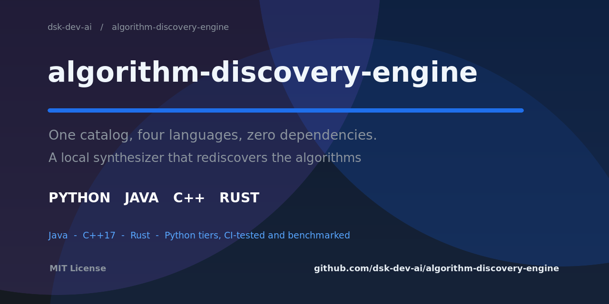

# algorithm-discovery-engine

**One catalog, four languages, zero dependencies — and a synthesizer that
rediscovers the algorithms for you.**



[](https://github.com/dsk-dev-ai/algorithm-discovery-engine/actions/workflows/ci.yml)
[](https://opensource.org/licenses/MIT)
[](https://github.com/sponsors/dsk-dev-ai)

The same algorithms and data structures, solved, tested, and benchmarked in
**Java, C++17, Rust, and Python**, from a single `catalog/problems.json` source
of truth with byte-identical generated test vectors across every language.

On top sits a **local algorithm synthesizer** that rediscovers verified
algorithms — Kadane, best-time-to-buy-and-sell, jump game — from input/output
examples alone (no APIs, no model calls), plus an **automated mathematical
pattern discovery** framework for integer sequences.

Every tier ships as pure standard-library code, and the repo is **CI-green by
default**: Python 3.10–3.13, Java 21, GCC C++17, stable Rust, and a
discovery-smoke job.

!!! tip "New in v1.0.1"
    A [desktop GUI](gui.md) built purely on the standard library (`python -m
    gui`) — discover patterns, run the synthesizer, and drive the engine
    without touching the terminal.

## Highlights

- **10 algorithms + 6 data structures**, implemented and tested in all four languages.
- **Cross-language benchmarks** — one harness, one comparison table.
- **Verified algorithm synthesis** — 7/7 targets rediscovered/confirmed by the
  local synthesizer, fuzz-checked against independent oracles.
- **Pattern discovery** — 10 built-in hypotheses with confidence, detail, and
  next-term predictions.
- **Zero runtime dependencies** — the solving engine, synthesizer, and GUI use
  only the standard library.

## Quick start

```sh
git clone https://github.com/dsk-dev-ai/algorithm-discovery-engine
cd algorithm-discovery-engine

python engine/runner.py test        # run the catalog suite in all 4 languages
python engine/runner.py bench       # benchmark all tiers side by side
python engine/runner.py discover    # synthesize + verify algorithms
python -m gui                       # open the desktop app
```

No install needed: Python ≥ 3.10 for the Python engine; a JDK, C++17 compiler,
and the Rust toolchain unlock the other three tiers.

## Documentation

| Page | What it covers |
| --- | --- |
| [Multi-language engine](engine.md) | catalog, language tiers, running, benchmarks |
| [Algorithm synthesis](synthesis.md) | how the synthewer discovers and verifies algorithms |
| [Pattern discovery](patterns.md) | discovering hypotheses for integer sequences |
| [Desktop GUI](gui.md) | launching the app and its three tabs |
| [Contributing](contributing.md) | setup, quality gates, CI, adding problems/targets |

## Project layout

```
catalog/problems.json            single source of truth (tests + examples)
catalog/discovery_targets.json   discovery targets (curated examples + oracles)
catalog/discoveries/             synthesizer reports + discovered solutions
engine/gen_tests.py              generates identical test vectors per language
engine/runner.py                 build / test / benchmark / synthesize dispatcher
src/ads/                         Python solving engine (regular + advanced)
src/algo_discovery/              pattern-discovery framework (original)
src/synth/                       local algorithm synthesizer
src/gui/                         Tkinter desktop app (stdlib only)
docs/                            this documentation site (MkDocs)
languages/java/src/ads/          Java tier (+ TestRunner, Benchmark)
languages/cpp/include/ads/       C++17 headers (+ tests, bench)
languages/rust/src/              Rust tier (+ examples/benchmark.rs)
```

MIT licensed — see [LICENSE](https://github.com/dsk-dev-ai/algorithm-discovery-engine/blob/main/LICENSE).